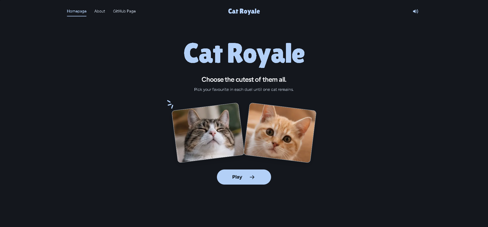
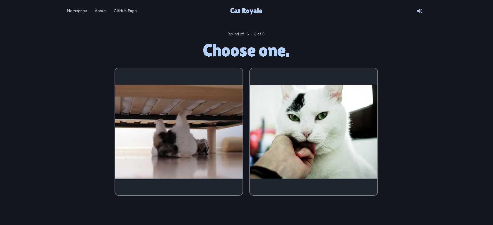
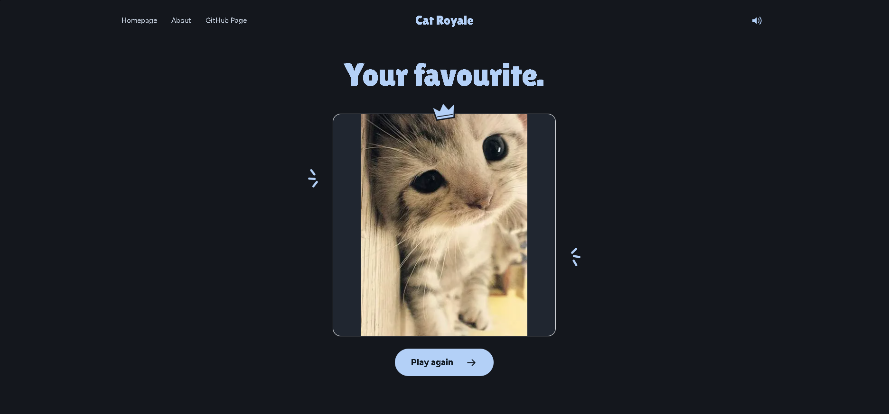

# Cat Royale 

A website where users can rank randomly selected cats, until only the cutest remains.

This is my first full web development project, built as a way to learn how a modern website works from development through deployment while doing something silly :)

## Planned Features

Cat Royale works great but is still under development.

This is the features i want to add to the project in the future:

*  Add user accounts
*  Save winning cat
*  Favourite Cats
*  Share the winning cat's image

### Technologies

Currently using:

* Next.js
* React
* TypeScript
* Tailwind CSS
* Git
* GitHub

More technologies will be added as I develop this website.

### What I'm Learning

I'm using this project to get more experience with:

* **Working with APIs** 
* **Website deployment**
* **Programming with ChatGPT**
* React and Next.js
* TypeScript
* Learning how to concretely put my web coding knowledge to use 
* Git and GitHub
* Databases

### Screenshots

#### Homepage

#### Tournament

#### Champion

